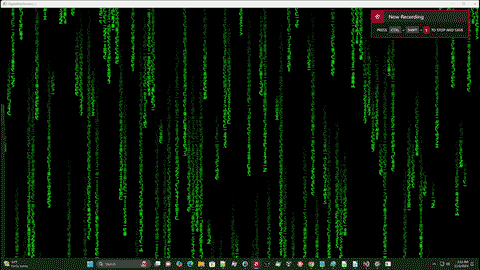

# DigitalRainShowers
  
A dynamic, Matrix-inspired screensaver coded in C++ and uses OpenGL and FreeGLUT, simulating the iconic green "digital rain" effect.  
This project brings the sci-fi aesthetic to life, cascading streams of characters with smooth animations and efficient rendering designed for modern displays.
